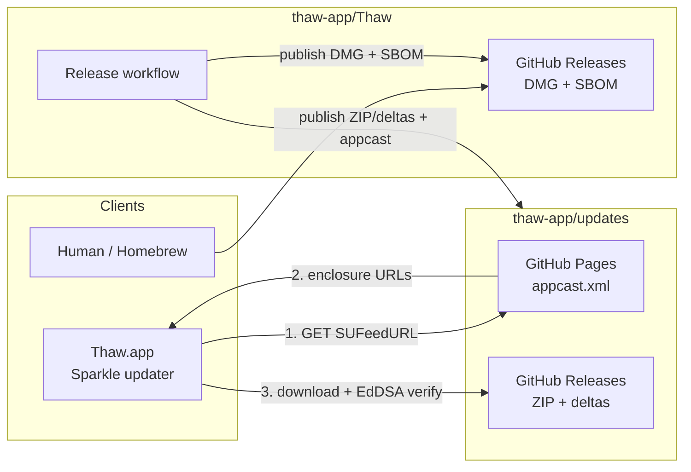

# Release and update distribution

How Thaw ships installers vs in-app updates.

## Who hosts what

| What | Where | URL pattern |
| --- | --- | --- |
| **Appcast** (`appcast.xml`) | [`thaw-app/updates`](https://github.com/thaw-app/updates) GitHub Pages | `https://thaw-app.github.io/updates/appcast.xml` |
| **Update payloads** (Sparkle ZIP + deltas, all channels) | `thaw-app/updates` GitHub Releases | `https://github.com/thaw-app/updates/releases/download/<tag>/…` |
| **DMG** (human installer) + **SBOM** + Sigstore bundles | [`thaw-app/Thaw`](https://github.com/thaw-app/Thaw) GitHub Releases only | `https://github.com/thaw-app/Thaw/releases/…` |

The app polls the appcast (`SUFeedURL` in `Thaw/Resources/Info.plist`). Sparkle
never downloads the DMG for in-app updates.

## Diagram

## In-app update path

1. App opens `https://thaw-app.github.io/updates/appcast.xml`.
2. Appcast lists the newest build and points at a ZIP (or delta) on `updates` releases.
3. Sparkle downloads that file from `thaw-app/updates`.
4. Sparkle verifies the EdDSA signature against `SUPublicEDKey`.
5. Sparkle installs the update.

The DMG is **not** on this path. It is for people who download an installer from
GitHub (or similar).

## What the release job does

Order matters: update assets are published **before** the Thaw DMG so a failed
`updates` publish does not leave a public installer without matching Sparkle
payloads.

1. Build and notarize.
2. Generate a CycloneDX SBOM of the resolved SwiftPM dependencies with Syft
   (`Thaw_<tag>.cdx.json`), and checksum the DMG.
3. Create Sparkle ZIP (and deltas when prior ZIPs exist).
4. Publish ZIP + deltas to **`thaw-app/updates`** (same tag).
5. Cosign-sign the installer DMG and SBOM; publish DMG + SBOM + `*.sigstore.json`
   + `*.sha256` to **`thaw-app/Thaw`**.
6. Push signed `appcast.xml` to **`thaw-app/updates`** `gh-pages`.

Workflow: [`.github/workflows/release.yml`](../.github/workflows/release.yml).  
Shared Sparkle action: [`thaw-app/org-ci` `sparkle-release`](https://github.com/thaw-app/org-ci/tree/main/actions/sparkle-release).

Required secret on Thaw: `UPDATES_GITHUB_TOKEN` (`contents: write` on
`thaw-app/updates`).

## Dry runs

Check **Dry run** when dispatching the workflow to build and report without
publishing anything. Steps 1–3 run normally; steps 4–6 are skipped, so no
GitHub Release is created (not even a draft), nothing is cosign-signed, and no
appcast is pushed to either `thaw-app/updates` or the legacy mirror.

Signing is skipped deliberately: cosign keyless signing writes a permanent,
public entry to the Sigstore transparency log that cannot be retracted, so a
rehearsal must not produce one.

The run's job summary then reports:

- every asset that *would* be uploaded, to which repository, with size and
  SHA-256, and whether the release would be a draft or published;
- the SBOM component inventory;
- a unified diff of the generated `appcast.xml` against the currently live feeds
  at `thaw-app.github.io/updates` and `stonerl.github.io/Thaw`, so you can see
  exactly what an update push would change.

The DMG checksum, SBOM (+ checksum), and generated appcast are attached to the
run as a `dry-run-<tag>` artifact for local inspection. The DMG itself is not
attached — it is large and is rebuilt by the real release run.

Dry runs use a separate concurrency group, so they never queue behind or block a
real release.

## Channels

Stable, beta, and alpha all use the same feed host and updates releases. The
appcast marks non-stable items with `sparkle:channel`. Tag suffixes map to
channels in the release workflow (`-beta` / `-rc` → beta, `-alpha` / `-nightly`
→ alpha).

## Legacy installs

Older builds may still poll `https://stonerl.github.io/Thaw/appcast.xml`
(GitHub Pages from [`stonerl/Thaw`](https://github.com/stonerl/Thaw) `main`,
path `/appcast.xml`). Release CI **mirrors** the same signed `appcast.xml` to
that repo after publishing to `thaw-app/updates`, so existing installs keep
updating without an HTTP redirect. Bridge / new builds ship the
`thaw-app.github.io/updates` `SUFeedURL` directly.

Historical enclosure URLs already in the appcast (for example old
`stonerl/Thaw` release ZIP links) stay as-is so EdDSA signatures remain valid.
Only **new** items point at `thaw-app/updates` releases.

## Related

- [Verifying releases](VERIFYING_RELEASES.md) — signatures, public key, how to check a build
- [Assurance case](ASSURANCE_CASE.md) — update authenticity claims
