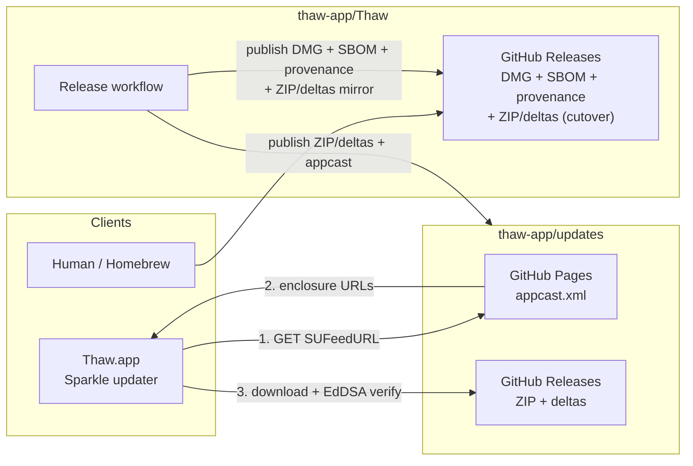

# Release and update distribution

How Thaw ships installers vs in-app updates.

## Who hosts what

| What | Where | URL pattern |
| --- | --- | --- |
| **Appcast** (`appcast.xml`) | [`thaw-app/updates`](https://github.com/thaw-app/updates) GitHub Pages | `https://thaw-app.github.io/updates/appcast.xml` |
| **Update payloads** (Sparkle ZIP + deltas, all channels) | `thaw-app/updates` GitHub Releases (**canonical**; appcast enclosures) | `https://github.com/thaw-app/updates/releases/download/<tag>/…` |
| **Update payloads (cutover mirror)** | Also attached to `thaw-app/Thaw` releases for ~2–3 releases | same files, Thaw release URLs (not used by appcast) |
| **DMG** (human installer) + **SBOM** + Sigstore bundles + SLSA provenance | [`thaw-app/Thaw`](https://github.com/thaw-app/Thaw) GitHub Releases only | `https://github.com/thaw-app/Thaw/releases/…` |

The app polls the appcast (`SUFeedURL` in `Thaw/Resources/Info.plist`). Sparkle
never downloads the DMG for in-app updates.

## Diagram



## In-app update path

1. App opens `https://thaw-app.github.io/updates/appcast.xml`.
2. Appcast lists the newest build and points at a ZIP (or delta) on `updates` releases.
3. Sparkle downloads that file from `thaw-app/updates`.
4. Sparkle verifies the EdDSA signature against `SUPublicEDKey`.
5. Sparkle installs the update.

The DMG is **not** on this path. It is for people who download an installer from
GitHub (or similar).

## What the release job does

Order matters: update assets are published **before** the Thaw DMG so a failed
`updates` publish does not leave a public installer without matching Sparkle
payloads.

1. Build and notarize.
2. Generate a CycloneDX SBOM of the resolved SwiftPM dependencies with Syft
   (`Thaw_<tag>.cdx.json`), and checksum the DMG.
3. Create Sparkle ZIP (and deltas when prior ZIPs exist).
4. Publish ZIP + deltas to **`thaw-app/updates`** (same tag).
5. Cosign-sign the installer DMG and SBOM; create the **`thaw-app/Thaw`** release
   **as a draft** with DMG + SBOM + `*.sigstore.json` + `*.sha256`, and (during
   cutover) the same Sparkle ZIP + deltas as a mirror.
6. Push signed `appcast.xml` to **`thaw-app/updates`** `gh-pages` (new enclosure
   URLs point at `updates`, not the Thaw mirror).
7. Sign build provenance for the DMG and SBOM in the reusable
   [`attest-build-provenance.yml`](../.github/workflows/attest-build-provenance.yml)
   workflow (a signing identity separate from the macOS build job); attach
   `*.intoto.jsonl` to the draft, then publish it when **Publish release** is
   checked.

### Cutover dual-publish

For the first ~2–3 releases after moving Sparkle hosting to `thaw-app/updates`,
ZIP and deltas are uploaded to **both** repos. The appcast keeps a single
enclosure URL per file, pointing at `updates`. The Thaw copies are a safety net
only. Remove the Thaw Sparkle attachments once a couple of updates-hosted
releases have shipped cleanly.

The release is drafted in step 5 and published in step 7 so that a failed
attestation leaves an unpublished draft rather than a public release with no
provenance. The appcast in step 6 goes out first, so an appcast entry's release
link can 404 for the minute or two the attestation jobs take; in-app updates are
unaffected, since Sparkle downloads from `thaw-app/updates`.

Workflow: [`.github/workflows/release.yml`](../.github/workflows/release.yml).  
Shared Sparkle action: [`thaw-app/org-ci` `sparkle-release`](https://github.com/thaw-app/org-ci/tree/main/actions/sparkle-release).

Required **release-environment** secret on Thaw: `UPDATES_GITHUB_TOKEN`
(`contents: write` on `thaw-app/updates`). The updates softprops step must
pass it as the action `token` input, because softprops v3 ignores `env: GITHUB_TOKEN`.

## Dispatching a release

The workflow is `workflow_dispatch` only, and its **tag** input is free text:
Actions `choice` inputs are a static list in the YAML, so they cannot be filled
from the tags that exist. [`scripts/release.sh`](../scripts/release.sh) supplies
that list locally instead. It reads the remote tags, filters them to the shape
the workflow accepts, lets you pick one, asks for the other inputs, and
dispatches the run.

```bash
scripts/release.sh          # override the target with REPO=owner/repo
```

Anything the script does can be done by hand from the Actions tab or with
`gh workflow run release.yml -f tag=2.1.0 ...`; the script only removes the
chance of dispatching a tag that does not exist.

### Release discussions

**Discussion category** opens a linked discussion in that category. It defaults
to `none` and only takes effect when **Publish release** is checked, because
GitHub creates the discussion on the draft-to-published transition, which is
step 7. Setting it on the draft in step 5 would do nothing.

## Dry runs

Check **Dry run** when dispatching the workflow to build and report without
publishing anything. Steps 1–3 run normally; steps 4–7 are skipped, so no
GitHub Release is created (not even a draft), nothing is cosign-signed or
attested, and no appcast is pushed to either `thaw-app/updates` or the legacy
mirror.

Signing and attestation are skipped deliberately: cosign keyless signing and
GitHub Artifact Attestations write permanent, public Sigstore / attestation
records that cannot be retracted, so a rehearsal must not produce them.

The run's job summary then reports:

- every asset that *would* be uploaded, to which repository, with size and
  SHA-256, and whether the release would be a draft or published;
- the SBOM component inventory;
- a unified diff of the generated `appcast.xml` against the currently live feeds
  at `thaw-app.github.io/updates` and `stonerl.github.io/Thaw`, so you can see
  exactly what an update push would change.

The DMG checksum, SBOM (+ checksum), and generated appcast are attached to the
run as a `dry-run-<tag>` artifact for local inspection. The DMG itself is not
attached, because it is large and is rebuilt by the real release run.

Dry runs use a separate concurrency group, so they never queue behind or block a
real release.

## Channels

All three channels share one appcast, served from the feed host named by
`SUFeedURL`. Stable items carry no `sparkle:channel`; beta and alpha items are
tagged with theirs. Tag suffixes map to channels in the release workflow
(`-beta` / `-rc` → beta, `-alpha` / `-nightly` → alpha), and the `channel`
input overrides the inference when a tag needs to go somewhere its suffix does
not imply.

Subscribers pick one channel in Settings › About. All three read the same
`SUFeedURL`; the appcast's `sparkle:channel` tags do the sorting.

| Subscriber | Receives |
| --- | --- |
| Stable | items with no `sparkle:channel` |
| Beta | untagged items, plus `beta` |
| Alpha | untagged items, plus `alpha`, never `beta` |

Beta is cumulative with stable, and that is not a choice: Sparkle's
`allowedChannels` only widens what an updater accepts. An item with no
`sparkle:channel` is on the default channel, and per `SPUUpdaterDelegate`,
"the default channel is always included in the allowed set." No delegate
return value keeps stable releases away from a subscriber.

Alpha is only selectable on the macOS the rewrite targets. The threshold is
`MacOSCompatibilityWarning.firstUnsupportedMajorVersion`, shared with the
startup warning whose alert tells the user that support for that macOS arrives
through this channel, so the release that raises the warning is the release
that reveals the channel. On earlier systems alpha is absent from the picker,
and a stored alpha selection is not honored, which keeps a user who moves back
to a supported macOS from sitting on a feed that will never offer them
anything.

Alpha carries the rewritten app built against the next macOS: a different
product line, not a riskier build of this one. It still shares the feed,
because Sparkle offers the newest item a subscriber is allowed to see, and a
3.x alpha item outranks anything the 2.x line can publish. An alpha subscriber
does see the stable items; they simply never win. This holds only while stable
stays behind alpha in version order, which is why no further 2.x stable
release can be numbered above the alpha line.

Alpha items are tagged `sparkle:channel` = `alpha`, so beta subscribers never
see them: beta allows `beta` and the default, not `alpha`. The two tracks run
in parallel rather than one containing the other.

Cross-version safety does not rely on any of that. `generate_appcast` derives
`sparkle:minimumSystemVersion` from each build's deployment target, so the 3.x
items carry `27.0` and Sparkle skips them on macOS 26, including later, when
3.0 goes final and drops its channel tag to become the default.

Promotion between stable and beta stays cheap, because they share a feed: to
move a build from beta to stable, drop its `sparkle:channel` rather than
publishing a second item for the same version. Beta subscribers already have
that build and are offered nothing; stable subscribers pick it up. Two items
sharing a version and differing only by channel is the case to avoid. It also
reaches the mirrored legacy appcast.

Switching *away* from alpha does not roll a user back. The alpha app's version
line is ahead of the shipping app's, so the stable feed offers nothing newer
and Sparkle stays put. Returning to the shipping app is a reinstall, which is
worth saying wherever alpha is advertised.

## Legacy installs

Older builds may still poll `https://stonerl.github.io/Thaw/appcast.xml`
(GitHub Pages from [`stonerl/Thaw`](https://github.com/stonerl/Thaw) `main`,
path `/appcast.xml`). Release CI **mirrors** the same signed `appcast.xml` to
that repo after publishing to `thaw-app/updates`, so existing installs keep
updating without an HTTP redirect. Bridge / new builds ship the
`thaw-app.github.io/updates` `SUFeedURL` directly.

Historical enclosure URLs already in the appcast (for example old
`stonerl/Thaw` release ZIP links) stay as-is so EdDSA signatures remain valid.
Only **new** items point at `thaw-app/updates` releases.

## Related

- [Verifying releases](VERIFYING_RELEASES.md): signatures, public key, how to check a build
- [Assurance case](ASSURANCE_CASE.md): update authenticity claims
